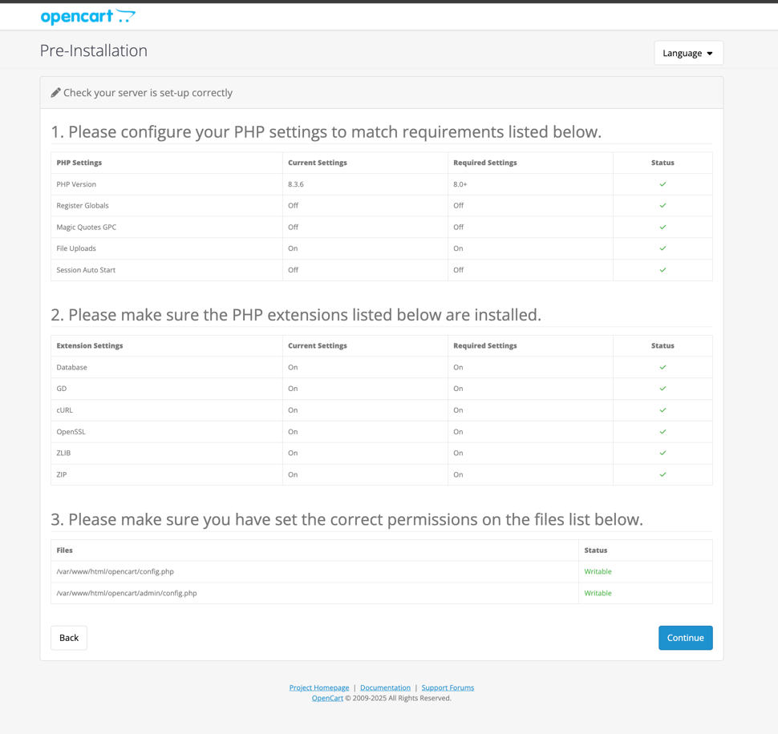

### **Simple Guide: Install OpenCart on AWS Ubuntu**

---

### **1. Launch Ubuntu Instance on AWS**
- Launch an EC2 instance with **Ubuntu 20.04+**.
- Open **HTTP (port 80)**, **HTTPS (port 443)**, and **SSH (port 22)** in the security group.

---

### **2. Connect to the Instance**
```bash
ssh -i your-key.pem ubuntu@your-instance-ip
```

---

### **3. Install Required Software**
```bash
sudo apt update && sudo apt upgrade -y
sudo apt install apache2 mysql-server php php-mysql php-zip php-curl php-gd php-mbstring php-xml unzip -y
sudo systemctl start apache2
```

---

### **4. Create OpenCart Database**
```bash
sudo mysql -u root -p
```
```sql
CREATE DATABASE opencart_db;
CREATE USER 'opencart_user'@'localhost' IDENTIFIED BY 'opencart_password';
GRANT ALL PRIVILEGES ON opencart_db.* TO 'opencart_user'@'localhost';
FLUSH PRIVILEGES;
EXIT;
```

---

### **5. Install OpenCart**
```bash
cd /var/www/html
wget https://github.com/opencart/opencart/releases/download/4.0.2.1/opencart-4.0.2.1.zip
unzip opencart-4.0.2.1.zip
mv upload/* .
rm -rf upload opencart-4.0.2.1.zip
sudo chown -R www-data:www-data /var/www/html
sudo chmod -R 755 /var/www/html
```

---

### **6. Configure Apache**
```bash
sudo nano /etc/apache2/sites-available/opencart.conf
```
Paste:
```
<VirtualHost *:80>
    ServerAdmin admin@yourdomain.com
    DocumentRoot /var/www/html
    <Directory /var/www/html/>
        Options Indexes FollowSymLinks
        AllowOverride All
        Require all granted
    </Directory>
    ErrorLog ${APACHE_LOG_DIR}/opencart_error.log
    CustomLog ${APACHE_LOG_DIR}/opencart_access.log combined
</VirtualHost>
```
Enable the site:
```bash
sudo a2ensite opencart
sudo a2enmod rewrite
sudo systemctl restart apache2
```

---

### **7. Complete Installation**
1. Open your browser:  
   `http://your-server-ip`
2. Follow the setup wizard:
    - Enter database credentials created in Step 4.
    - Set up an admin username and password.
3. Delete the `install` folder:
   ```bash
   sudo rm -rf /var/www/html/install
   ```

---

### **8. Secure with SSL (Optional)**
```bash
sudo apt install certbot python3-certbot-apache -y
sudo certbot --apache
```

---

You're done! Access OpenCart at `http://your-server-ip/admin` to start managing your store.  

---



sudo mv /var/www/html/opencart/system/storage/ /var/www/storage
